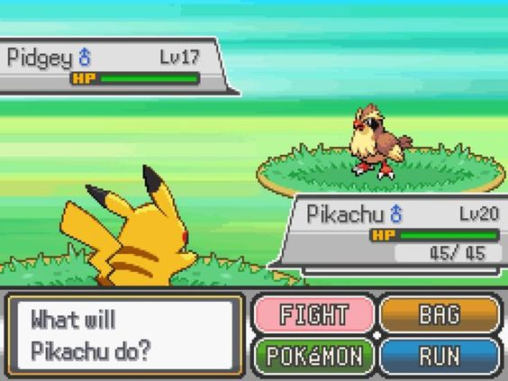

## Breve explicação:

_Testando o sistema de escolhas no python._

O objetivo final vai ser fazer um joguinho no estilo do pokemon clássico.
Como esse aqui:

)

---

## Baixando e Testando:

### Para Windows:

Abra o PowerShell como administrador e escreva:

```winget install --id Git.Git -e --source winget```

Isso irá instalar o git no seu computador.
Após você pode clonar o repositório com:

```git clone https://github.com/elliot5x/RPGzin.git```

Navegar até ele:

```cd RPGzin```

e executar:

```Python ./game.py```

_**Atenção** Lembre-se de ter instalado o python._

Caso não tenha, Baixe aqui: [Download do Python](https://www.python.org/ftp/python/3.13.0/python-3.13.0-amd64.exe)

## Meu projeto

Esse é o meu primeiro projeto "grande", espero que chegue em alguém e que vocês possam me ajudar a melhorar o meu programa/habilidades em python.

Agradeço desde já.

_Elliot5x._